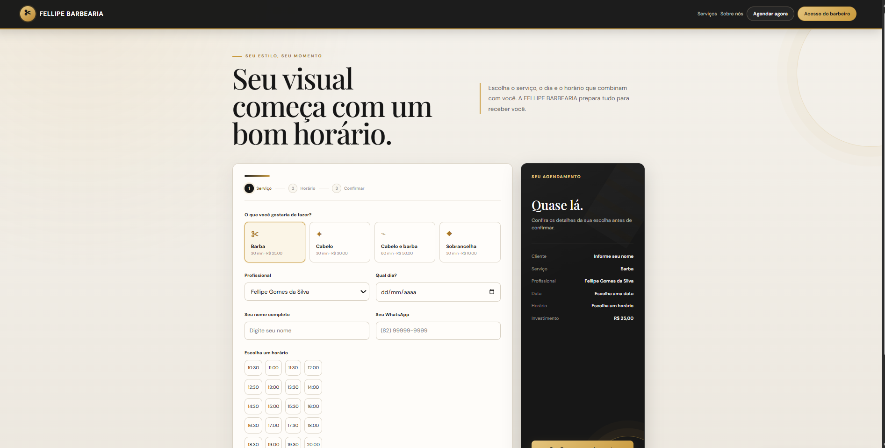

# ✂️ Sistema de Agendamento para Barbearia

Sistema web de agendamento online desenvolvido para facilitar o gerenciamento de horários de uma barbearia.

## 🖥️ Preview do sistema

## 🌐 Projeto publicado

Acesse o sistema:

https://felipe-barbearia-two.vercel.app

## 📋 Funcionalidades

- Agendamento de serviços
- Seleção de data e horário
- Consulta de horários disponíveis
- Cadastro do nome e WhatsApp do cliente
- Seleção de serviços
- Controle de horários ocupados
- Área de acesso do barbeiro
- Gerenciamento de agendamentos
- Cancelamento de agendamentos

## 💈 Serviços

- Cabelo e barba — R$ 50,00
- Cabelo — R$ 30,00
- Sobrancelha — R$ 10,00
- Barba — R$ 25,00

## 🛠️ Tecnologias utilizadas

- HTML
- CSS
- JavaScript
- Supabase
- PostgreSQL
- Vercel
- Git
- GitHub

## 🎯 Objetivo

Projeto desenvolvido como parte do meu aprendizado em desenvolvimento web e tecnologia, com o objetivo de aplicar conhecimentos de programação em um sistema funcional.

## 👨‍💻 Desenvolvedor

**Micael Bezerra**